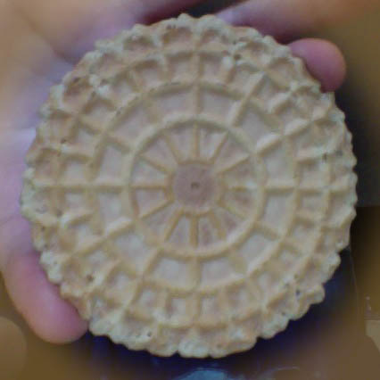

# dodofarm
Genetic dodecaphonic composer

## notes
### storing notes
- bit mask? base64?
- smallest size that covers A0-C8
- min: 21, max: 108, count: 87
- Given list:   `["Db7", "E7", "D7", "Gb7", "Db7", "D7", "C7", "Eb7", "Gb7", "Ab7", "E7", "C7"]`
- OR string:    `Db7,E7,D7,Gb7,Db7,D7,C7,Eb7,Gb7,Ab7,E7,C7`
- Produce:      `[97, 100, 98, 102, 97, 98, 96, 99, 102, 104, 100, 96]`
- Produce:      `[97, 100, 98, 102, 97, 98, 96, 99, 102, 104, 100, 96]`
- `midichar = function(n){console.log(MIDI.noteToKey[n]+' ['+String.fromCharCode(n)+']')}`
- midichar(21), (32), 33

### representing notes
- bifurcated twelwe space
- archimedes spiral with 12 steps

### how notes relate to sound
#### [math of note frequency](http://www.intmath.com/trigonometric-graphs/music.php).
- `note(0) = A4`
- `f=(440)*(2)^(note/12)`

#### [wikipedia on piano notes](http://en.wikipedia.org/wiki/Piano_key_frequencies).
- `note(49) = 440Hz (A4)`
- `note = 12 * log2(freq/440Hz) + 49`
- `freq = [{2^(1/12)}^(note-49)] * 440Hz`

## how to grade musical phrases
Bifurcated Cookie|Pitch star
:-:|:-:
  |  

## GATTACA
#### how to encode/decode ACGT as 12 notes